# Kit Architecture Guide

This document describes Kit's architecture: how the system is organized, how data flows through it, and how the major subsystems interact.

---

## Table of Contents

1. [System Overview](#system-overview)
2. [Request Flow](#request-flow)
3. [Component Deep Dives](#component-deep-dives)
   - [Gateway Layer](#gateway-layer)
   - [Session Management](#session-management)
   - [Agent Runtime](#agent-runtime)
   - [Memory System](#memory-system)
   - [Knowledge System](#knowledge-system)
   - [Tool System](#tool-system)
   - [Skills System](#skills-system)
   - [Provider Registry](#provider-registry)
   - [MCP Integration](#mcp-integration)
   - [Background Services](#background-services)
   - [Web Frontend](#web-frontend)
4. [Multi-Agent Architecture](#multi-agent-architecture)
5. [Data Storage Layout](#data-storage-layout)
6. [Security Model](#security-model)

---

## System Overview

Kit is a multi-agent AI assistant with a Gateway-Runtime architecture. A FastAPI gateway handles HTTP/WebSocket traffic and manages sessions, while the runtime layer orchestrates LLM interactions, tool execution, and a multi-layer memory system. Multiple agents form a team, each with their own persona, tools, knowledge, and memory, coordinated through a delegation protocol.

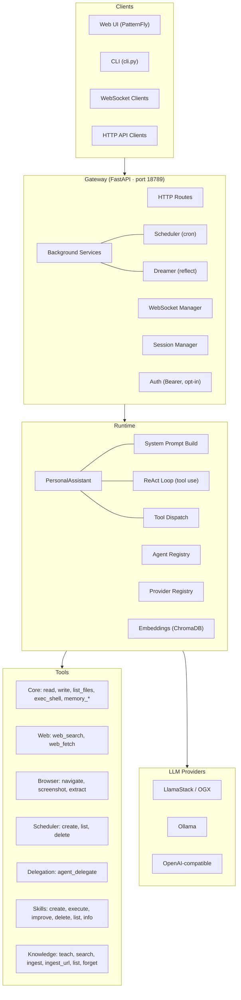
```mermaid
graph TB
    subgraph Clients
        WebUI["Web UI (PatternFly)"]
        CLI["CLI (cli.py)"]
        WS["WebSocket Clients"]
        HTTP["HTTP API Clients"]
    end

    subgraph Gateway["Gateway (FastAPI · port 18789)"]
        Routes["HTTP Routes"]
        WSMgr["WebSocket Manager"]
        SessMgr["Session Manager"]
        Auth["Auth (Bearer, opt-in)"]
        BG["Background Services"]
        Sched["Scheduler (cron)"]
        Dream["Dreamer (reflect)"]
        BG --- Sched
        BG --- Dream
    end

    subgraph Runtime
        PA["PersonalAssistant"]
        SysPrompt["System Prompt Build"]
        ReAct["ReAct Loop (tool use)"]
        ToolDisp["Tool Dispatch"]
        PA --- SysPrompt
        PA --- ReAct
        PA --- ToolDisp

        AgentReg["Agent Registry"]
        ProvReg["Provider Registry"]
        Embed["Embeddings (ChromaDB)"]
    end

    subgraph Tools
        Core["Core: read, write, list_files, exec_shell, memory_*"]
        Web["Web: web_search, web_fetch"]
        Browser["Browser: navigate, screenshot, extract"]
        SchedTools["Scheduler: create, list, delete"]
        Deleg["Delegation: agent_delegate"]
        SkillTools["Skills: create, execute, improve, delete, list, info"]
        KnowTools["Knowledge: teach, search, ingest, ingest_url, list, forget"]
    end

    subgraph LLM["LLM Providers"]
        LS["LlamaStack / OGX"]
        Ollama["Ollama"]
        OAI["OpenAI-compatible"]
    end

    Clients --> Gateway
    Gateway --> Runtime
    Runtime --> Tools
    Runtime --> LLM
```

---

## Request Flow

### Chat Message (Streaming)

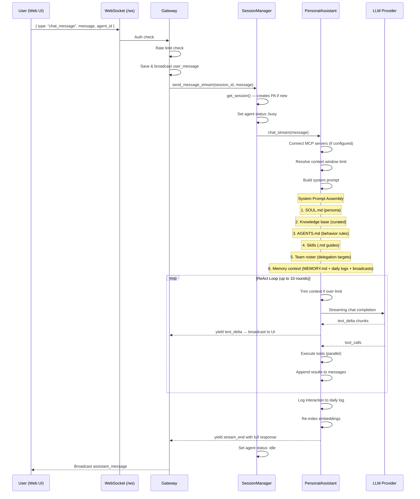
```mermaid
sequenceDiagram
    participant U as User (Web UI)
    participant WS as WebSocket (/ws)
    participant GW as Gateway
    participant SM as SessionManager
    participant PA as PersonalAssistant
    participant LLM as LLM Provider

    U->>WS: { type: "chat_message", message, agent_id }
    WS->>GW: Auth check
    GW->>GW: Rate limit check
    GW->>GW: Save & broadcast user_message
    GW->>SM: send_message_stream(session_id, message)
    SM->>SM: get_session() — creates PA if new
    SM->>SM: Set agent status: busy

    SM->>PA: chat_stream(message)
    PA->>PA: Connect MCP servers (if configured)
    PA->>PA: Resolve context window limit
    PA->>PA: Build system prompt

    Note over PA: System Prompt Assembly
    Note over PA: 1. SOUL.md (persona)
    Note over PA: 2. Knowledge base (curated)
    Note over PA: 3. AGENTS.md (behavior rules)
    Note over PA: 4. Skills (.md guides)
    Note over PA: 5. Team roster (delegation targets)
    Note over PA: 6. Memory context (MEMORY.md + daily logs + broadcasts)

    loop ReAct Loop (up to 10 rounds)
        PA->>PA: Trim context if over limit
        PA->>LLM: Streaming chat completion
        LLM-->>PA: text_delta chunks
        PA-->>GW: yield text_delta → broadcast to UI
        LLM-->>PA: tool_calls
        PA->>PA: Execute tools (parallel)
        PA->>PA: Append results to messages
    end

    PA->>PA: Log interaction to daily log
    PA->>PA: Re-index embeddings
    PA-->>GW: yield stream_end with full response
    SM->>SM: Set agent status: idle
    GW-->>U: Broadcast assistant_message
```

### Delegation Flow

When an agent uses `agent_delegate` to hand a task to a teammate:

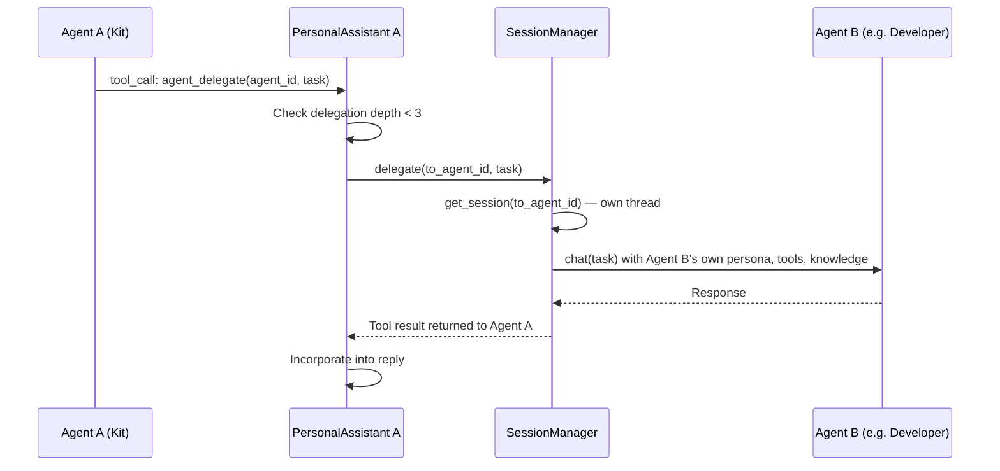
```mermaid
sequenceDiagram
    participant A as Agent A (Kit)
    participant PA as PersonalAssistant A
    participant SM as SessionManager
    participant B as Agent B (e.g. Developer)

    A->>PA: tool_call: agent_delegate(agent_id, task)
    PA->>PA: Check delegation depth < 3
    PA->>SM: delegate(to_agent_id, task)
    SM->>SM: get_session(to_agent_id) — own thread
    SM->>B: chat(task) with Agent B's own persona, tools, knowledge
    B-->>SM: Response
    SM-->>PA: Tool result returned to Agent A
    PA->>PA: Incorporate into reply
```

---

## Component Deep Dives

### Gateway Layer

**File:** `gateway/server.py`

The gateway is a FastAPI application that serves as the single entry point for all client communication.

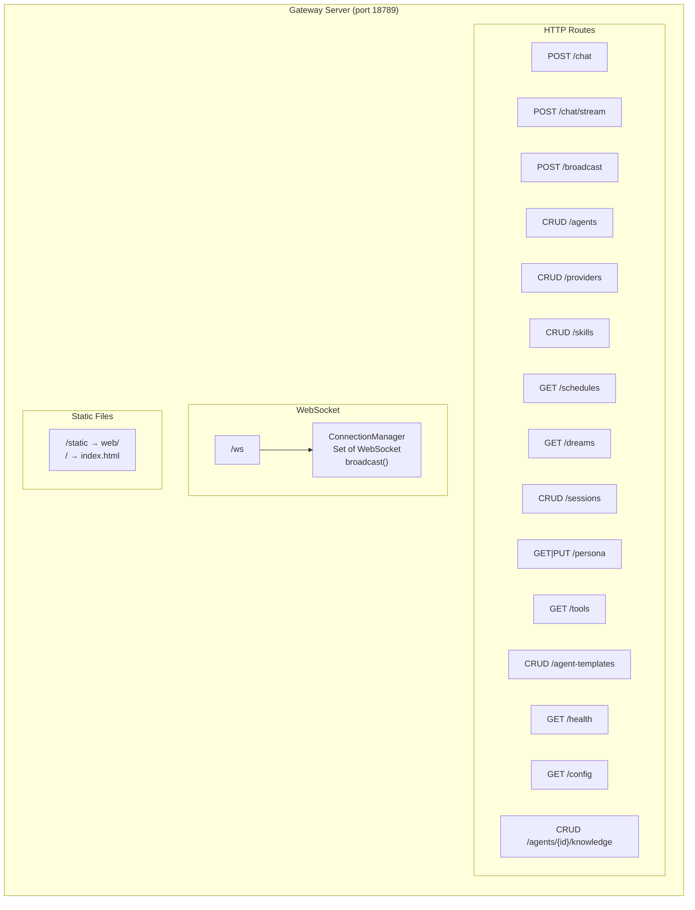
```mermaid
graph LR
    subgraph "Gateway Server (port 18789)"
        subgraph "HTTP Routes"
            Chat["POST /chat"]
            Stream["POST /chat/stream"]
            Bcast["POST /broadcast"]
            Agents["CRUD /agents"]
            Provs["CRUD /providers"]
            Skills["CRUD /skills"]
            Scheds["GET /schedules"]
            Dreams["GET /dreams"]
            Sess["CRUD /sessions"]
            Persona["GET|PUT /persona"]
            Tools["GET /tools"]
            Templates["CRUD /agent-templates"]
            Health["GET /health"]
            Config["GET /config"]
            Knowledge["CRUD /agents/{id}/knowledge"]
        end
        subgraph "WebSocket"
            WSEndpoint["/ws"]
            ConnMgr["ConnectionManager<br/>Set of WebSocket<br/>broadcast()"]
        end
        subgraph "Static Files"
            Static["/static → web/<br/>/ → index.html"]
        end
    end

    WSEndpoint --> ConnMgr
```

Key responsibilities:
- **Routing:** Maps HTTP and WebSocket messages to the session manager
- **Broadcasting:** All connected clients receive real-time updates via WebSocket
- **Auth:** Optional bearer token gating (`GATEWAY_TOKEN` env var); WebSocket auth via subprotocol or `?token=`
- **Rate limiting:** Per-user request throttling (via `gateway/rate_limit.py`)
- **Static serving:** Hosts the PatternFly web UI

### Session Management

**File:** `gateway/session_manager.py`

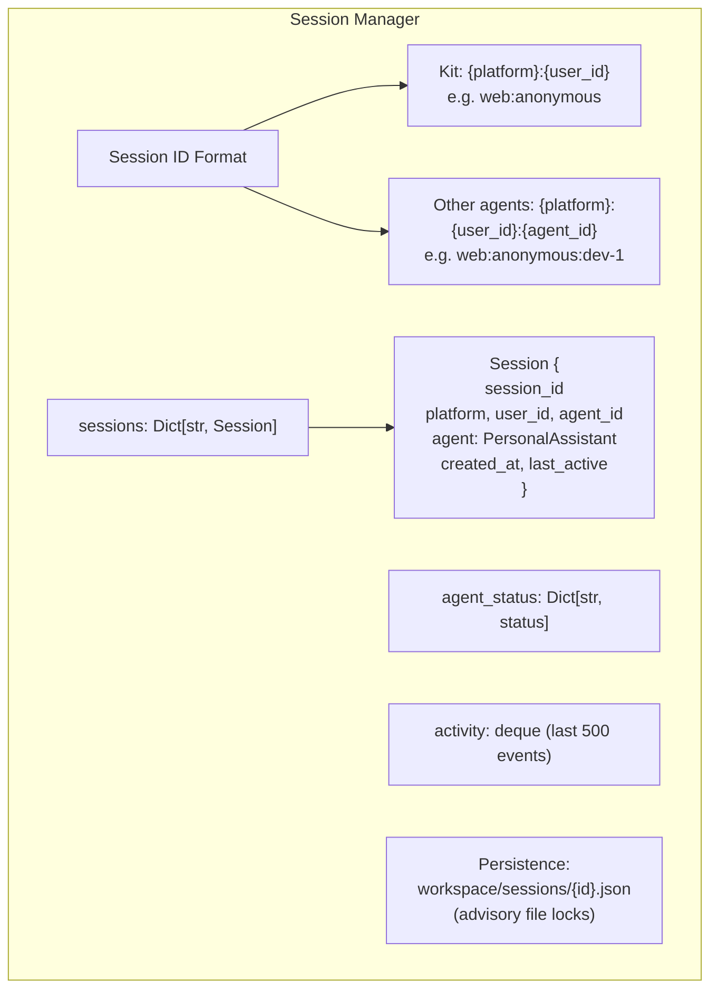
```mermaid
graph TB
    subgraph "Session Manager"
        ID["Session ID Format"]
        KitSess["Kit: {platform}:{user_id}<br/>e.g. web:anonymous"]
        OtherSess["Other agents: {platform}:{user_id}:{agent_id}<br/>e.g. web:anonymous:dev-1"]
        ID --> KitSess
        ID --> OtherSess

        Sessions["sessions: Dict[str, Session]"]
        Session["Session {<br/>  session_id<br/>  platform, user_id, agent_id<br/>  agent: PersonalAssistant<br/>  created_at, last_active<br/>}"]
        Sessions --> Session

        Status["agent_status: Dict[str, status]"]
        Activity["activity: deque (last 500 events)"]

        Persist["Persistence:<br/>workspace/sessions/{id}.json<br/>(advisory file locks)"]
    end
```

Key behaviors:
- **Lazy creation:** Sessions are created on first message, not ahead of time
- **Agent binding:** Each session is permanently bound to one agent
- **Session ID divergence:** Kit (the default agent) uses the legacy `{platform}:{user_id}` format; all other agents append `:{agent_id}` to get their own separate thread
- **Message persistence:** Chat history is saved to JSON files with advisory file locking (`fcntl`)
- **Activity tracking:** Tool calls and status changes are recorded for the team activity feed

### Agent Runtime

**File:** `runtime/agent.py`

The `PersonalAssistant` class is the core orchestrator. Each session gets one instance.

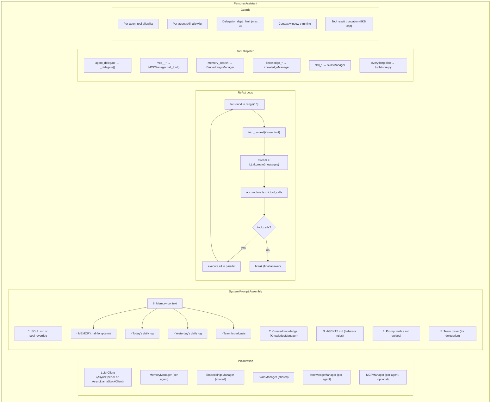
```mermaid
graph TB
    subgraph "PersonalAssistant"
        subgraph "Initialization"
            Client["LLM Client<br/>(AsyncOpenAI or AsyncLlamaStackClient)"]
            Mem["MemoryManager (per-agent)"]
            Emb["EmbeddingsManager (shared)"]
            Skills["SkillsManager (shared)"]
            Know["KnowledgeManager (per-agent)"]
            MCP["MCPManager (per-agent, optional)"]
        end

        subgraph "System Prompt Assembly"
            S1["1. SOUL.md or soul_override"]
            S2["2. Curated knowledge (KnowledgeManager)"]
            S3["3. AGENTS.md (behavior rules)"]
            S4["4. Prompt skills (.md guides)"]
            S5["5. Team roster (for delegation)"]
            S6["6. Memory context"]
            S6a["   - MEMORY.md (long-term)"]
            S6b["   - Today's daily log"]
            S6c["   - Yesterday's daily log"]
            S6d["   - Team broadcasts"]
            S6 --> S6a & S6b & S6c & S6d
        end

        subgraph "ReAct Loop"
            Loop["for round in range(10):"]
            Trim["trim_context(if over limit)"]
            LLMCall["stream = LLM.create(messages)"]
            Acc["accumulate text + tool_calls"]
            Branch{tool_calls?}
            Exec["execute all in parallel"]
            Done["break (final answer)"]
            Loop --> Trim --> LLMCall --> Acc --> Branch
            Branch -->|yes| Exec --> Loop
            Branch -->|no| Done
        end

        subgraph "Tool Dispatch"
            D1["agent_delegate → _delegate()"]
            D2["mcp__* → MCPManager.call_tool()"]
            D3["memory_search → EmbeddingsManager"]
            D4["knowledge_* → KnowledgeManager"]
            D5["skill_* → SkillsManager"]
            D6["everything else → tools/core.py"]
        end

        subgraph "Guards"
            G1["Per-agent tool allowlist"]
            G2["Per-agent skill allowlist"]
            G3["Delegation depth limit (max 3)"]
            G4["Context window trimming"]
            G5["Tool result truncation (8KB cap)"]
        end
    end
```

### Memory System

**Files:** `runtime/memory.py`, `runtime/embeddings.py`

Three layers, from fastest/smallest to slowest/largest:

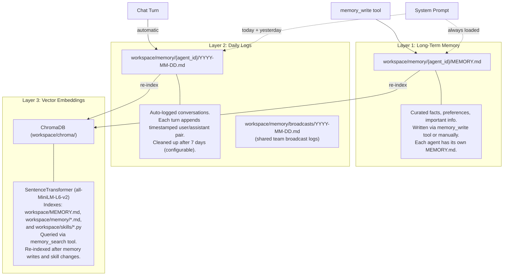
```mermaid
graph TB
    subgraph "Layer 1: Long-Term Memory"
        L1["workspace/memory/{agent_id}/MEMORY.md"]
        L1desc["Curated facts, preferences, important info.<br/>Written via memory_write tool or manually.<br/>Each agent has its own MEMORY.md."]
        L1 --- L1desc
    end

    subgraph "Layer 2: Daily Logs"
        L2["workspace/memory/{agent_id}/YYYY-MM-DD.md"]
        L2desc["Auto-logged conversations.<br/>Each turn appends timestamped user/assistant pair.<br/>Cleaned up after 7 days (configurable)."]
        L2 --- L2desc
        Bcast["workspace/memory/broadcasts/YYYY-MM-DD.md<br/>(shared team broadcast logs)"]
    end

    subgraph "Layer 3: Vector Embeddings"
        L3["ChromaDB (workspace/chroma/)"]
        L3desc["SentenceTransformer (all-MiniLM-L6-v2)<br/>Indexes: workspace/MEMORY.md, workspace/memory/*.md,<br/>and workspace/skills/*.py<br/>Queried via memory_search tool.<br/>Re-indexed after memory writes and skill changes."]
        L3 --- L3desc
    end

    Chat["Chat Turn"] -->|automatic| L2
    MemWrite["memory_write tool"] --> L1
    L1 -->|re-index| L3
    L2 -->|re-index| L3

    Prompt["System Prompt"] -.->|always loaded| L1
    Prompt -.->|today + yesterday| L2
```

**Always in system prompt:** Layer 1 (MEMORY.md) + Layer 2 (today's + yesterday's daily log + broadcasts)
**On demand:** Layer 3 (semantic search via `memory_search` tool)

### Knowledge System

**File:** `runtime/knowledge.py`

Per-agent knowledge with two layers, separate from the shared memory system:

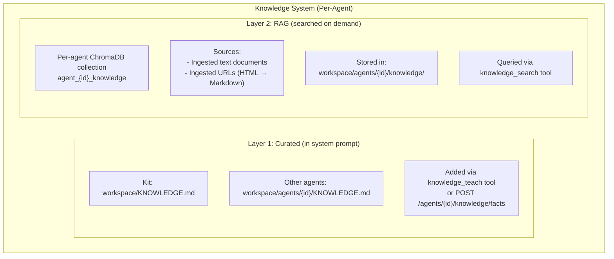
```mermaid
graph TB
    subgraph "Knowledge System (Per-Agent)"
        subgraph "Layer 1: Curated (in system prompt)"
            Kit["Kit: workspace/KNOWLEDGE.md"]
            Other["Other agents: workspace/agents/{id}/KNOWLEDGE.md"]
            Method["Added via knowledge_teach tool<br/>or POST /agents/{id}/knowledge/facts"]
        end

        subgraph "Layer 2: RAG (searched on demand)"
            Coll["Per-agent ChromaDB collection<br/>agent_{id}_knowledge"]
            Sources["Sources:<br/>- Ingested text documents<br/>- Ingested URLs (HTML → Markdown)"]
            Storage["Stored in:<br/>workspace/agents/{id}/knowledge/"]
            Query["Queried via knowledge_search tool"]
        end
    end
```

### Tool System

**Files:** `tools/core.py`, `tools/web.py`, `tools/browser.py`, `tools/scheduler.py`, `tools/skills.py`, `tools/delegation.py`, `tools/knowledge.py`

28 built-in tools across 7 modules:

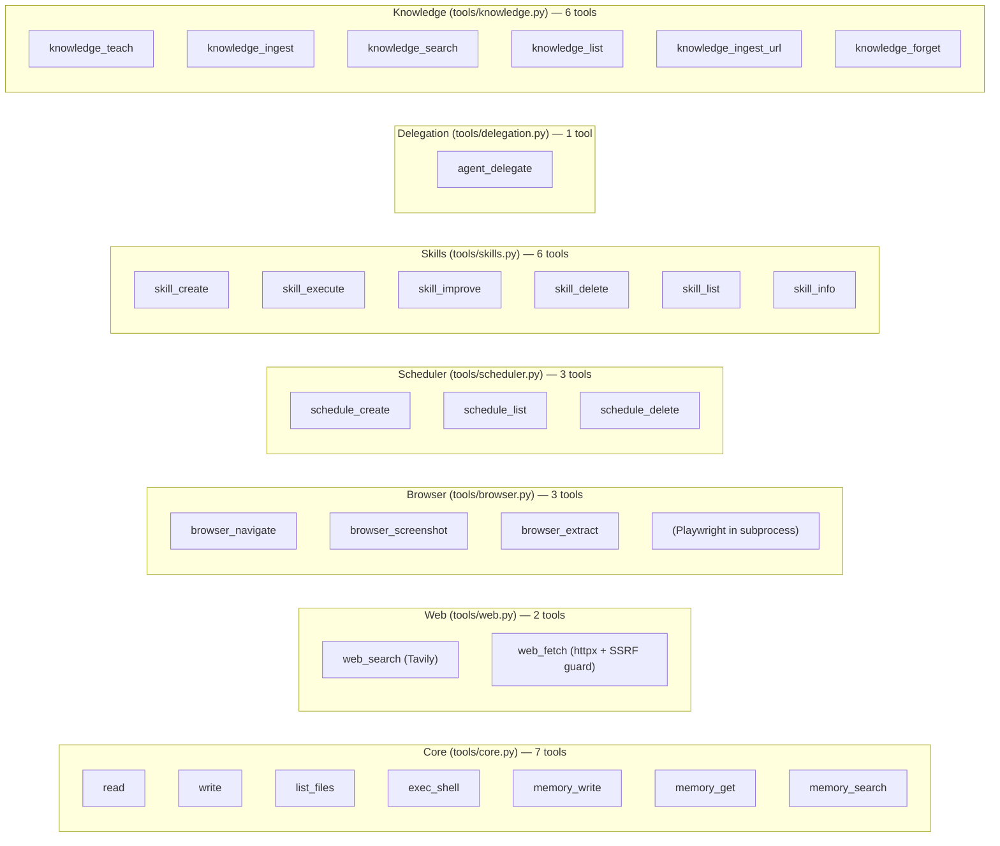
```mermaid
graph LR
    subgraph "Core (tools/core.py) — 7 tools"
        read & write & list_files & exec_shell
        memory_write & memory_get & memory_search
    end

    subgraph "Web (tools/web.py) — 2 tools"
        web_search["web_search (Tavily)"]
        web_fetch["web_fetch (httpx + SSRF guard)"]
    end

    subgraph "Browser (tools/browser.py) — 3 tools"
        browser_navigate & browser_screenshot & browser_extract
        bp["(Playwright in subprocess)"]
    end

    subgraph "Scheduler (tools/scheduler.py) — 3 tools"
        schedule_create & schedule_list & schedule_delete
    end

    subgraph "Skills (tools/skills.py) — 6 tools"
        skill_create & skill_execute & skill_improve
        skill_delete & skill_list & skill_info
    end

    subgraph "Delegation (tools/delegation.py) — 1 tool"
        agent_delegate
    end

    subgraph "Knowledge (tools/knowledge.py) — 6 tools"
        knowledge_teach & knowledge_ingest & knowledge_search
        knowledge_list & knowledge_ingest_url & knowledge_forget
    end
```

**Dispatch routing** (`runtime/agent.py`):
- `memory_search` → `EmbeddingsManager.semantic_search()`
- `knowledge_*` → `KnowledgeManager`
- `skill_*` → `SkillsManager`
- `agent_delegate` → `SessionManager.delegate()`
- `mcp__*` → `MCPManager.call_tool()`
- Everything else → `tools/core.py:execute_tool()`

**Per-agent scoping:** Agents define `tools: ["read", "write", ...]` or `tools: "*"` (unrestricted, Kit's default).

### Skills System

**File:** `runtime/skills.py`

Two types of skills, both auto-discovered from `workspace/skills/`:

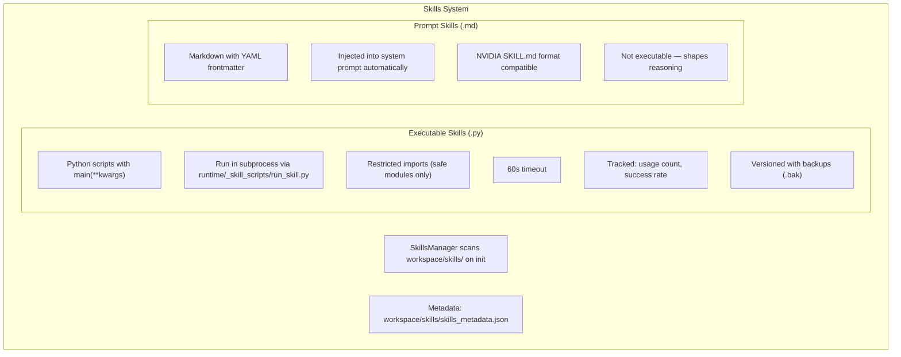
```mermaid
graph TB
    subgraph "Skills System"
        subgraph "Executable Skills (.py)"
            ExDesc["Python scripts with main(**kwargs)"]
            ExRun["Run in subprocess via runtime/_skill_scripts/run_skill.py"]
            ExSafe["Restricted imports (safe modules only)"]
            ExTime["60s timeout"]
            ExTrack["Tracked: usage count, success rate"]
            ExVer["Versioned with backups (.bak)"]
        end

        subgraph "Prompt Skills (.md)"
            PrDesc["Markdown with YAML frontmatter"]
            PrInj["Injected into system prompt automatically"]
            PrFmt["NVIDIA SKILL.md format compatible"]
            PrNo["Not executable — shapes reasoning"]
        end

        Discovery["SkillsManager scans workspace/skills/ on init"]
        Meta["Metadata: workspace/skills/skills_metadata.json"]
    end
```

### Provider Registry

**File:** `runtime/providers.py`

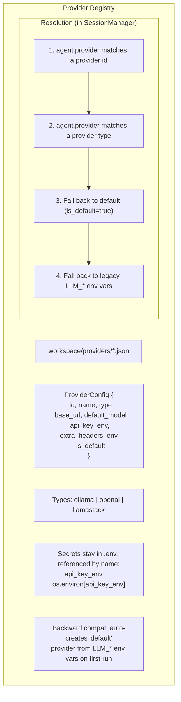
```mermaid
graph TB
    subgraph "Provider Registry"
        Store["workspace/providers/*.json"]
        Config["ProviderConfig {<br/>  id, name, type<br/>  base_url, default_model<br/>  api_key_env, extra_headers_env<br/>  is_default<br/>}"]
        Types["Types: ollama | openai | llamastack"]

        subgraph "Resolution (in SessionManager)"
            R1["1. agent.provider matches a provider id"]
            R2["2. agent.provider matches a provider type"]
            R3["3. Fall back to default (is_default=true)"]
            R4["4. Fall back to legacy LLM_* env vars"]
            R1 --> R2 --> R3 --> R4
        end

        Secrets["Secrets stay in .env, referenced by name:<br/>api_key_env → os.environ[api_key_env]"]
        Compat["Backward compat: auto-creates 'default'<br/>provider from LLM_* env vars on first run"]
    end
```

### MCP Integration

**File:** `runtime/mcp.py`

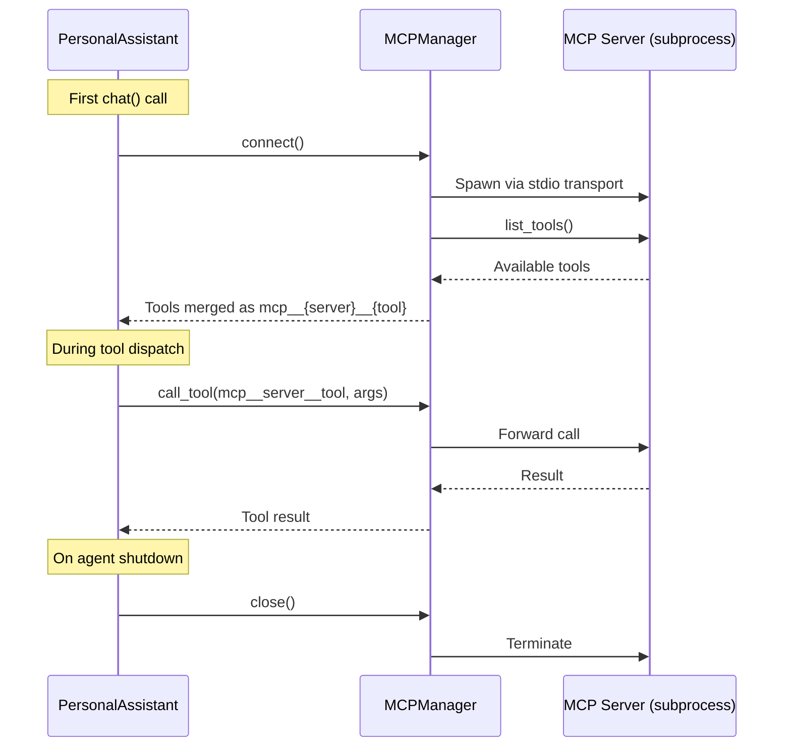
```mermaid
sequenceDiagram
    participant PA as PersonalAssistant
    participant MCP as MCPManager
    participant Srv as MCP Server (subprocess)

    Note over PA: First chat() call
    PA->>MCP: connect()
    MCP->>Srv: Spawn via stdio transport
    MCP->>Srv: list_tools()
    Srv-->>MCP: Available tools
    MCP-->>PA: Tools merged as mcp__{server}__{tool}

    Note over PA: During tool dispatch
    PA->>MCP: call_tool(mcp__server__tool, args)
    MCP->>Srv: Forward call
    Srv-->>MCP: Result
    MCP-->>PA: Tool result

    Note over PA: On agent shutdown
    PA->>MCP: close()
    MCP->>Srv: Terminate
```

Configuration is per-agent in the agent definition:
```json
{
  "mcp_servers": {
    "server-name": {
      "command": "npx",
      "args": ["-y", "@some/mcp-server"],
      "env": {"API_KEY": "${MY_KEY}"}
    }
  }
}
```

- **Transport:** stdio only (subprocess)
- **Env vars:** `${VAR}` expanded from `os.environ`
- **Retry:** Auto-retry failed servers on next `chat()` call

### Background Services

**Files:** `gateway/scheduler.py`, `gateway/dreamer.py`

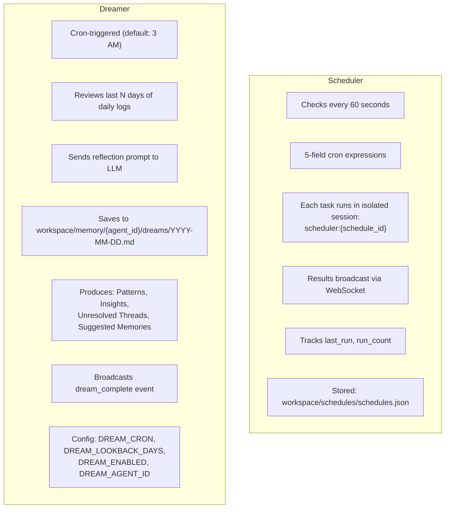
```mermaid
graph TB
    subgraph "Scheduler"
        S1["Checks every 60 seconds"]
        S2["5-field cron expressions"]
        S3["Each task runs in isolated session:<br/>scheduler:{schedule_id}"]
        S4["Results broadcast via WebSocket"]
        S5["Tracks last_run, run_count"]
        S6["Stored: workspace/schedules/schedules.json"]
    end

    subgraph "Dreamer"
        D1["Cron-triggered (default: 3 AM)"]
        D2["Reviews last N days of daily logs"]
        D3["Sends reflection prompt to LLM"]
        D4["Saves to workspace/memory/{agent_id}/dreams/YYYY-MM-DD.md"]
        D5["Produces: Patterns, Insights,<br/>Unresolved Threads, Suggested Memories"]
        D6["Broadcasts dream_complete event"]
        D7["Config: DREAM_CRON, DREAM_LOOKBACK_DAYS,<br/>DREAM_ENABLED, DREAM_AGENT_ID"]
    end
```

### Web Frontend

**Files:** `web/index.html`, `web/app.js`, `web/styles.css`

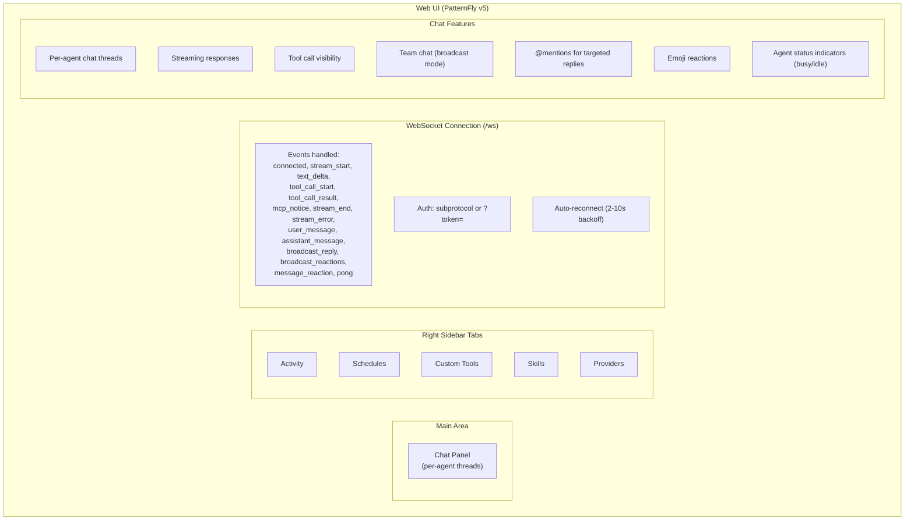
```mermaid
graph TB
    subgraph "Web UI (PatternFly v5)"
        subgraph "Main Area"
            ChatPanel["Chat Panel<br/>(per-agent threads)"]
        end

        subgraph "Right Sidebar Tabs"
            T1["Activity"]
            T2["Schedules"]
            T3["Custom Tools"]
            T4["Skills"]
            T5["Providers"]
        end

        subgraph "WebSocket Connection (/ws)"
            Events["Events handled:<br/>connected, stream_start, text_delta,<br/>tool_call_start, tool_call_result,<br/>mcp_notice, stream_end, stream_error,<br/>user_message, assistant_message,<br/>broadcast_reply, broadcast_reactions,<br/>message_reaction, pong"]
            WSAuth["Auth: subprotocol or ?token="]
            Reconnect["Auto-reconnect (2-10s backoff)"]
        end

        subgraph "Chat Features"
            F1["Per-agent chat threads"]
            F2["Streaming responses"]
            F3["Tool call visibility"]
            F4["Team chat (broadcast mode)"]
            F5["@mentions for targeted replies"]
            F6["Emoji reactions"]
            F7["Agent status indicators (busy/idle)"]
        end
    end
```

---

## Multi-Agent Architecture

Kit supports a team of specialized agents coordinated by a central "Kit" agent:

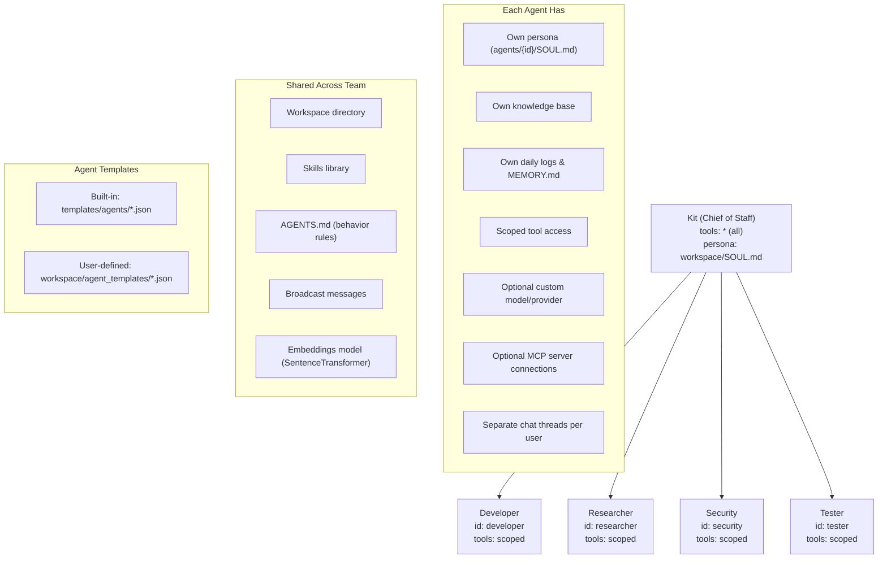
```mermaid
graph TB
    Kit["Kit (Chief of Staff)<br/>tools: * (all)<br/>persona: workspace/SOUL.md"]

    Dev["Developer<br/>id: developer<br/>tools: scoped"]
    Res["Researcher<br/>id: researcher<br/>tools: scoped"]
    Sec["Security<br/>id: security<br/>tools: scoped"]
    Test["Tester<br/>id: tester<br/>tools: scoped"]

    Kit --> Dev & Res & Sec & Test

    subgraph "Each Agent Has"
        Own1["Own persona (agents/{id}/SOUL.md)"]
        Own2["Own knowledge base"]
        Own3["Own daily logs & MEMORY.md"]
        Own4["Scoped tool access"]
        Own5["Optional custom model/provider"]
        Own6["Optional MCP server connections"]
        Own7["Separate chat threads per user"]
    end

    subgraph "Shared Across Team"
        Sh1["Workspace directory"]
        Sh2["Skills library"]
        Sh3["AGENTS.md (behavior rules)"]
        Sh4["Broadcast messages"]
        Sh5["Embeddings model (SentenceTransformer)"]
    end

    subgraph "Agent Templates"
        BT["Built-in: templates/agents/*.json"]
        UT["User-defined: workspace/agent_templates/*.json"]
    end
```

**Broadcast flow:**

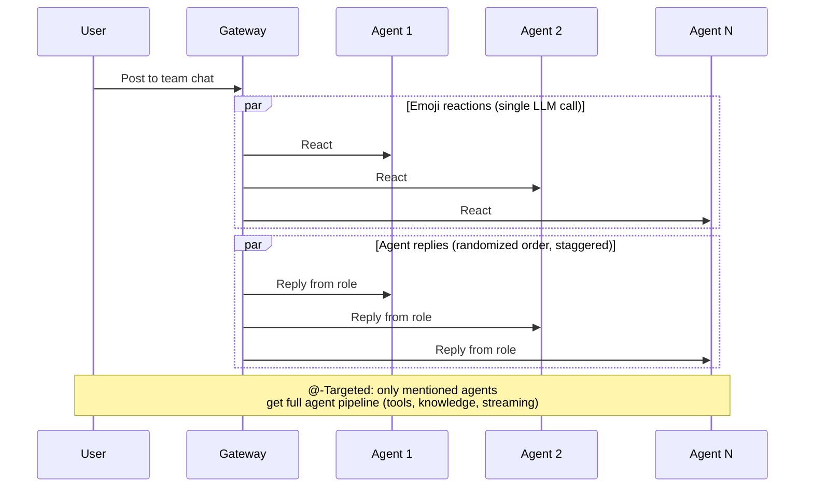
```mermaid
sequenceDiagram
    participant U as User
    participant GW as Gateway
    participant A1 as Agent 1
    participant A2 as Agent 2
    participant AN as Agent N

    U->>GW: Post to team chat
    par Emoji reactions (single LLM call)
        GW->>A1: React
        GW->>A2: React
        GW->>AN: React
    end
    par Agent replies (randomized order, staggered)
        GW->>A1: Reply from role
        GW->>A2: Reply from role
        GW->>AN: Reply from role
    end

    Note over U,AN: @-Targeted: only mentioned agents<br/>get full agent pipeline (tools, knowledge, streaming)
```

---

## Data Storage Layout

```
workspace/
├── SOUL.md                          # Kit's persona
├── AGENTS.md                        # Shared agent behavior rules
├── KNOWLEDGE.md                     # Kit's curated knowledge (created on demand)
├── USER.md.example                  # User preferences template
├── MEMORY.md.example                # Memory template
│
├── memory/
│   ├── kit/                         # Kit's memory
│   │   ├── MEMORY.md                # Kit's long-term memory
│   │   ├── 2026-09-10.md            # Daily logs
│   │   └── dreams/
│   │       └── 2026-09-13.md        # Dream reflections
│   ├── dev-1/                       # Other agent memories
│   │   ├── MEMORY.md
│   │   └── 2026-09-10.md
│   └── broadcasts/                  # Shared broadcast logs
│       └── 2026-09-10.md
│
├── agents/
│   ├── dev-1.json                   # Agent metadata
│   ├── dev-1/
│   │   ├── SOUL.md                  # Agent persona
│   │   └── knowledge/               # Agent knowledge docs
│   └── ...
│
├── agent_templates/                 # User-defined templates
│   └── researcher.json
│
├── sessions/                        # Chat history (JSON)
│   ├── web_anonymous.json
│   ├── web_anonymous.json.lock
│   ├── web_anonymous_dev-1.json
│   └── ...
│
├── providers/                       # LLM provider configs
│   └── default.json
│
├── skills/                          # Custom tools & skills
│   ├── skills_metadata.json
│   ├── count-python-files.py        # Executable skill
│   └── python-best-practices.md     # Prompt skill
│
├── schedules/                       # Scheduled tasks
│   └── schedules.json
│
├── knowledge/                       # Workspace-level knowledge
│
├── chroma/                          # ChromaDB vector storage
│   ├── chroma.sqlite3
│   └── {collection-uuid}/
│
└── tmp/                             # Scratch space

templates/
└── agents/                          # Built-in agent templates
    ├── developer.json
    ├── researcher.json
    ├── security.json
    └── tester.json
```

---

## Security Model

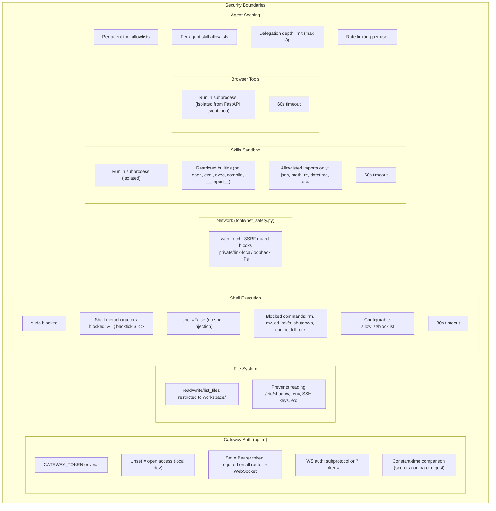
```mermaid
graph TB
    subgraph "Security Boundaries"
        subgraph "Gateway Auth (opt-in)"
            GA1["GATEWAY_TOKEN env var"]
            GA2["Unset = open access (local dev)"]
            GA3["Set = Bearer token required on all routes + WebSocket"]
            GA4["WS auth: subprotocol or ?token="]
            GA5["Constant-time comparison (secrets.compare_digest)"]
        end

        subgraph "File System"
            FS1["read/write/list_files restricted to workspace/"]
            FS2["Prevents reading /etc/shadow, .env, SSH keys, etc."]
        end

        subgraph "Shell Execution"
            SH1["sudo blocked"]
            SH2["Shell metacharacters blocked: & | ; backtick $ < >"]
            SH3["shell=False (no shell injection)"]
            SH4["Blocked commands: rm, mv, dd, mkfs, shutdown, chmod, kill, etc."]
            SH5["Configurable allowlist/blocklist"]
            SH6["30s timeout"]
        end

        subgraph "Network (tools/net_safety.py)"
            NET1["web_fetch: SSRF guard blocks<br/>private/link-local/loopback IPs"]
        end

        subgraph "Skills Sandbox"
            SK1["Run in subprocess (isolated)"]
            SK2["Restricted builtins (no open, eval, exec, compile, __import__)"]
            SK3["Allowlisted imports only: json, math, re, datetime, etc."]
            SK4["60s timeout"]
        end

        subgraph "Browser Tools"
            BR1["Run in subprocess (isolated from FastAPI event loop)"]
            BR2["60s timeout"]
        end

        subgraph "Agent Scoping"
            AG1["Per-agent tool allowlists"]
            AG2["Per-agent skill allowlists"]
            AG3["Delegation depth limit (max 3)"]
            AG4["Rate limiting per user"]
        end
    end
```
